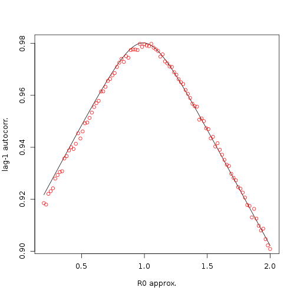
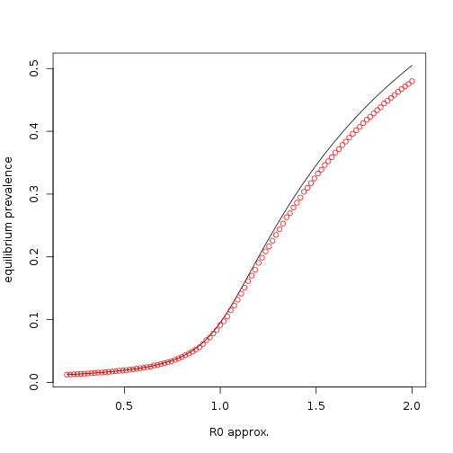

Roughly a year ago, I did a series of simulations to figure out the
relationship between parameters of network SIS disease model and
the cross-correlation in the number of infectives. One interesting
thing I observed was that lag-1 cross-correlations are highest when
the disease is just barely subsisting. Reading [O'Regan and Drake
2013](http://dx.doi.org/10.1007/s12080-013-0185-5), I learned that
it is easy to calculate the autocorrelation in the number of
infectives in the quasistationary state of a stochastic SIS
model. Here I verify this for myself numerically.


```r
infeq <- function(R0=2, recoveryRate=1, nImports=1, nNodes=1000){
    n <- nNodes
    b <- R0*recoveryRate
    h <- -log(1 - nImports/nNodes)
    g <- recoveryRate
    ystar <- 1/2*(b - g - h + sqrt(b^2 - 2*b*g + g^2 + 2*(b + g)*h + h^2))/b
    lambda <- b - 2*b*ystar  - g - h
    ac <- exp(-abs(lambda))
    c(bn=b,h=h, g=g, lambda=lambda,ystar=ystar,ac=ac)
}

library(Rcpp)

cppFunction('
  NumericMatrix sisd(double R0, double g, double h, double N, double I0, int maxsteps){
  // taken in part from http://phylodynamics.blogspot.com/2013/06/continuous-time-markov-chain-ctmc.html
    NumericMatrix xx(maxsteps, 2L);
    double t = 0;
    double I = I0;
    double b = R0 * g / N;
    int n = 0;
    do{
      double avoidanceProb = exp(-b*I - h);
      int Inew = rbinom(1, (N - I), 1 - avoidanceProb)[0];
      int Snew = rbinom(1, I, g)[0];
      I += Inew;
      I -= Snew;
      xx(n,0) = n;
      xx(n,1) = I;
      n++;
    } while (n < maxsteps);
    return xx;
  }')

set.seed(1014)

N <- 1000
tmpf <- function(x) sisd(R0=x, g=.1, h=0.001, N=N, I0=N/2, maxsteps=100000)

R0 <- seq(from=.2, to=2, len=100)
system.time(ts <- lapply(R0, tmpf))
```

```
##    user  system elapsed 
##   9.784   0.157   9.960
```

```r
tmpf <- function(x, burnin=1000) {
    del <- seq_len(1000)
    y <- x[-del, 2]
    mu <- mean(y)
    n <- length(y)
    ss <- var(y)
    c(ac=mean((y[-length(y)] - mu)* (y[-1] - mu) )/ ss,
      ystar=mu/N)
}
sim <- sapply(ts, tmpf)

tmpf <- function(x) infeq(R0=x, recoveryRate=.1, nImports=1, nNodes=N)[c('ac', 'ystar')]
theo <- sapply(R0, tmpf)

sim <- data.frame(t(sim), R0=R0, type='simulation')
theo <- data.frame(t(theo), R0=R0, type='theory')

cmp <- rbind(sim, theo)

plot(ac~R0, data=cmp[cmp$type=='theory', ], type='l',
     ylab='lag-1 autocorr.', xlab='R0 approx.')
points(ac~R0, data=cmp[cmp$type=='simulation',], col=2)
```

 

```r
plot(ystar~R0, data=cmp[cmp$type=='theory', ], type='l',
     ylab='equilibrium prevalence', xlab='R0 approx.')
points(ystar~R0, data=cmp[cmp$type=='simulation',], col=2)
```

 

The theory (lines) and simulation (red circles) agree fairly well
even though the theory is for continuous time and simulations were
in discrete time. Also, theoretical equilibrium prevalence is the
limit as the population size approaches infinity.
